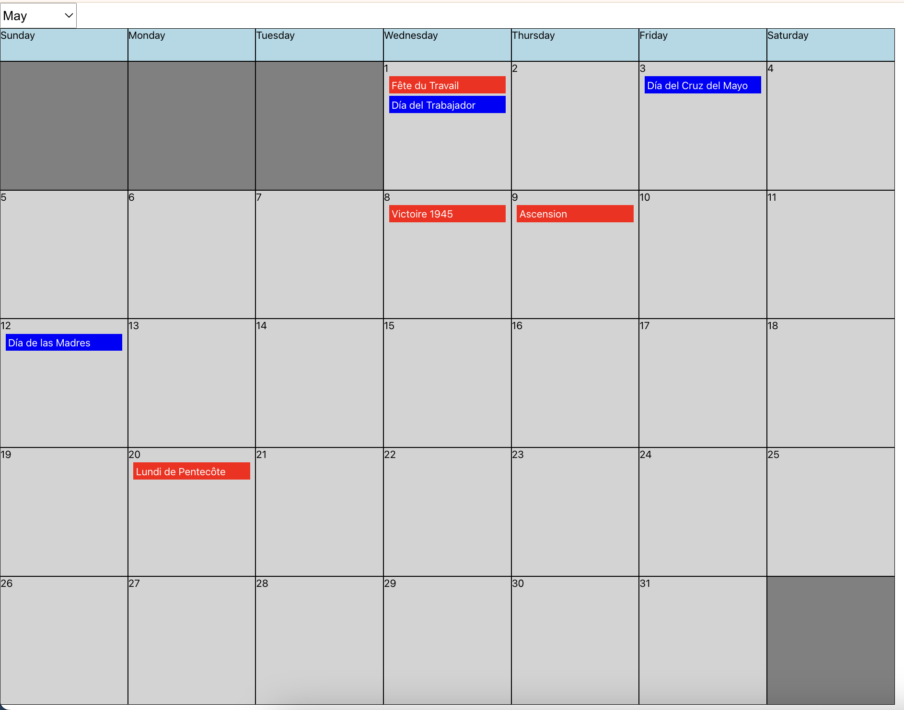
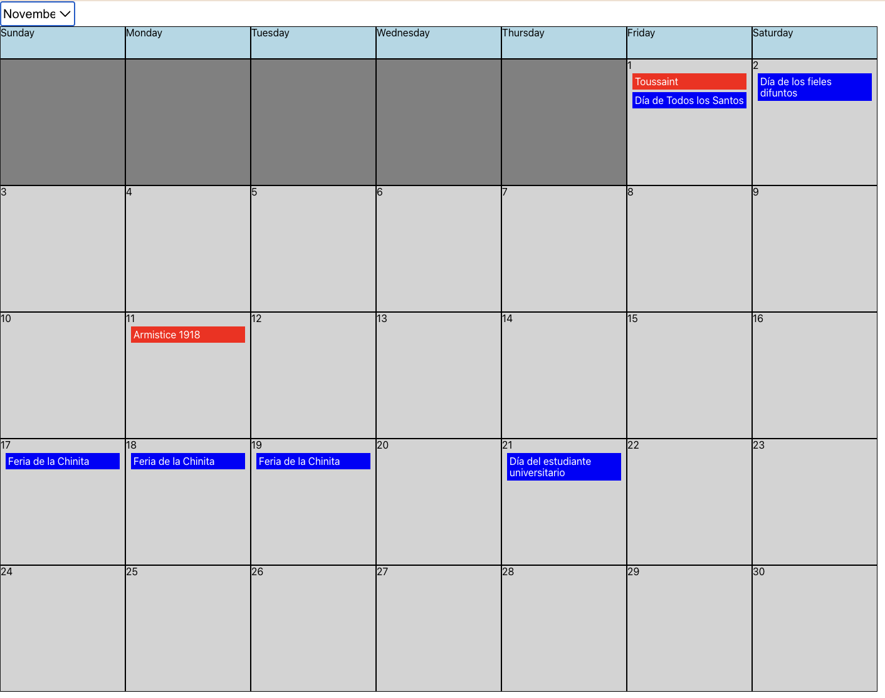

# Hearth Frontend Take Home Interview
## Welcome to Hearth's Frontend Take Home Interview. 

For this interview we'd like you to create a calendar app that displays the holidays of two different countries in the correct date cells. There will be a month dropdown so we can view this calendar for any month in 2024. It should look similar to the calendar app below, but you have complete freedom on how you wish to style the app. You can also choose any two countries you want. In this example we're showing holidays for France and Venezuela.

You will be using a public api called `https://date.nager.at/` to get holiday data. You can see an example request for the endpoint we want you to use here `https://date.nager.at/Api`. 

Ideally this interview should take you around 2 hours to complete. Honestly this is a new interview so let us know if you think we should add or remove scope to better fit our 2 hour goal.

## The features we want you to add:
### 1. When I open the app I want to see a calendar that shows the current month. 
* This calendar should have a header row that labels the days of the week. 
* This calendar should have cells for each day of the month, properly labeled with the date number displayed in the cell. 
* Each date cell should be in the column of its proper weekday. For example May 1st, 2024 is on a Wednesday so it should be in the same column as the Wednesday header cell.
* Each row in the calendar must have 7 elements. This means that often there should be some empty date cells before the first day and after the last day of the month. (The dark gray cells in the pictures). Make sure to include these empty date cells and give them a different styling than normal date cells to show that they aren't associated with an actual date

### 2. I want to be able to use the dropdown to see each month of 2024.
* Changing the current month in the dropdown should change the calendar so that we should see the correct dates of the selected month.
* Each month of 2024 should start and end on the correct day of the week
* Each month should have the proper amount of empty cells before the first day of the month and after the last day of the month.

### 3. I want to be able to display the holidays of two different countries on the calendar
* Use the `https://date.nager.at/` api to fetch the holidays of two different countries. (You can choose whichever two countries you'd like)
* Display the name of the holidays for each country in the correct date cell. Use different colors so that we can differentiate which holiday came from which country. In our example we used blue for Venezuela and red for France.
* Have this work for every month in 2024. 

# Notes about the codebase
* You can add any package you want to complete this project.
* You can add styling any way you'd like
* We have a set of helpful constants in `src/constants.ts` that you are free to use. Also feel free to add any additional constants that you need.
* This project was built on top of create react app

# Getting Started with Create React App

This project was bootstrapped with [Create React App](https://github.com/facebook/create-react-app).

## Available Scripts

In the project directory, you can run:

### `yarn start`

Runs the app in the development mode.\
Open [http://localhost:3000](http://localhost:3000) to view it in the browser.

The page will reload if you make edits.\
You will also see any lint errors in the console.

### `yarn test`

Launches the test runner in the interactive watch mode.\
See the section about [running tests](https://facebook.github.io/create-react-app/docs/running-tests) for more information.

### `yarn build`

Builds the app for production to the `build` folder.\
It correctly bundles React in production mode and optimizes the build for the best performance.

The build is minified and the filenames include the hashes.\
Your app is ready to be deployed!

See the section about [deployment](https://facebook.github.io/create-react-app/docs/deployment) for more information.

### `yarn eject`

**Note: this is a one-way operation. Once you `eject`, you can’t go back!**

If you aren’t satisfied with the build tool and configuration choices, you can `eject` at any time. This command will remove the single build dependency from your project.

Instead, it will copy all the configuration files and the transitive dependencies (webpack, Babel, ESLint, etc) right into your project so you have full control over them. All of the commands except `eject` will still work, but they will point to the copied scripts so you can tweak them. At this point you’re on your own.

You don’t have to ever use `eject`. The curated feature set is suitable for small and middle deployments, and you shouldn’t feel obligated to use this feature. However we understand that this tool wouldn’t be useful if you couldn’t customize it when you are ready for it.

## Learn More

You can learn more in the [Create React App documentation](https://facebook.github.io/create-react-app/docs/getting-started).

To learn React, check out the [React documentation](https://reactjs.org/).
